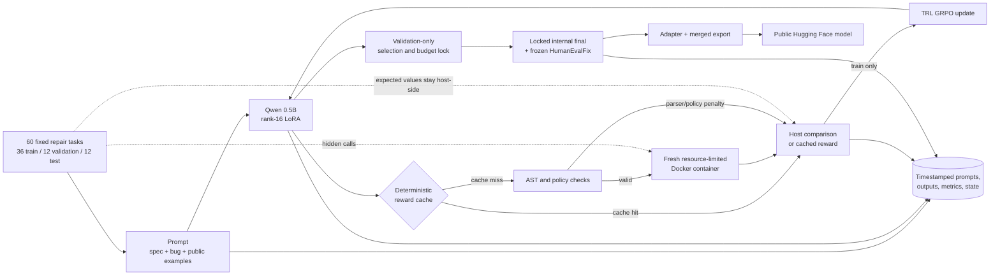

# MiniBug-RL

MiniBug-RL is a complete, measured recipe for adding test-driven reinforcement learning to a tiny code LLM on the recorded 8 GB test system. It fine-tunes the 0.49B-parameter [Qwen2.5-Coder-0.5B-Instruct](https://huggingface.co/Qwen/Qwen2.5-Coder-0.5B-Instruct/blob/ea3f2471cf1b1f0db85067f1ef93848e38e88c25/README.md) with 100 steps of TRL GRPO and a rank-16 LoRA adapter. The policy repairs one short Python function, receives scalar rewards derived from hidden unit tests, and never receives hidden expected values in its prompts.

The resulting public model is [BurnyCoder/qwen2.5-coder-0.5b-swe-rl](https://huggingface.co/BurnyCoder/qwen2.5-coder-0.5b-swe-rl). Its weights and results were first published at immutable commit [`5b6e22a4…`](https://huggingface.co/BurnyCoder/qwen2.5-coder-0.5b-swe-rl/commit/5b6e22a4c6c01bec95d10e93a0fc78666eb9c543); the current fact-corrected card is at [`8dc6fa7d…`](https://huggingface.co/BurnyCoder/qwen2.5-coder-0.5b-swe-rl/commit/8dc6fa7df8a09e157e3a5be1ec17b5d8b8aa4f43). The [documentation audit](reports/evidence/documentation-audit.json) confirms that only `README.md` changed between them. The repository root is a directly loadable merged model; `adapter/` contains the separate PEFT artifact.

## Methodology and data flow

The experiment uses a 60-task repository-authored curriculum declared clean-room and fixed in the [producing source commit](https://github.com/BurnyCoder/llm-rl-software-engineering/commit/7027bc55baecc00fad51cbe2b8f030dca2c91c1e): 36 train, 12 validation, and 12 final-test repairs. Prompts contain a specification, buggy function, and two public examples. Four sampled repairs per training prompt receive a deterministic-cache lookup; cache misses are parsed, with structurally and policy-valid candidates run in fresh resource-limited Docker containers. Hidden answers stay on the host. The reward is hidden-test pass fraction + a `1.0` full-solve bonus + `0.1` for a valid function, with bounded runtime and explicit parser/policy penalties. GRPO updates only LoRA parameters; the base revision stays pinned.

Checkpoint choice and the 100-step budget decision used training diagnostics and validation model outcomes only. Pre-training structural validation and original-bug sandbox canaries covered all internal splits, but the internal final split was first used to score model candidates after checkpoint 100 and the 100-step budget were locked; those final outcomes did not influence selection. HumanEvalPack examples, candidate outcomes, and scores entered neither training nor model selection. The current logger writes each complete prompt/completion pair before scoring; scored paths link the later outcome by generation ID. The historical producing commit logged completed reference-run scoring records in full after scoring. See [methodology](docs/methodology.md), the [curriculum contract](data/README.md), and the checked [run evidence](reports/evidence/run-summary.json).



Valid cache-miss code runs through Docker, not Python `exec` in the training process. Containers use no network, a read-only root, a non-root user, dropped capabilities, no host bind or volume mounts, a 16 MiB `noexec,nosuid` `/tmp` tmpfs, and CPU/memory/PID/wall-time limits. Containers still share the host kernel, so read the [security model](docs/security.md) before adapting this to hostile code.

## Measured result

The checked [run summary](reports/evidence/run-summary.json) records an NVIDIA GeForce RTX 5070 Laptop GPU with 8,151 MiB reported memory. Main training took 1,174 seconds, peaked at 1,849,278,976 allocated bytes (1.72 GiB), changed all 336 observed trainable LoRA tensors, and ended without the reward-collapse stop.

| Locked evaluation | Base model | 100-step model | Paired difference |
|---|---:|---:|---:|
| Validation greedy full repairs (12 tasks) | 7/12 | 8/12 | +1 task |
| Validation mean greedy hidden fraction | 0.7708 | 0.8333 | +0.0625, paired percentile-bootstrap 95% interval [−0.1458, 0.2917] |
| Internal-test greedy full repairs (12 tasks) | 5/12 | 6/12 | +1 task |
| Internal-test mean greedy hidden fraction | 0.6083 | 0.6042 | −0.0042, paired percentile-bootstrap 95% interval [−0.2917, 0.2625] |
| Internal observed sampled success@4 | 10/12 | 10/12 | 0 tasks |
| Internal invalid candidates (60 each) | 19 | 1 | −18 candidates |
| HumanEvalFix greedy pass@1 (164 tasks) | 37/164 | 38/164 | +0.0061, paired percentile-bootstrap 95% interval [−0.0183, 0.0366] |

The validation gate passed, and malformed internal outputs fell sharply. The held-out correctness intervals cross zero, however, so this run demonstrates a practically functioning single-function repair-RL pipeline and fewer invalidly structured internal candidates—not conclusive correctness or repository-scale software-engineering improvement. HumanEvalFix used this project’s 3-second Docker deadline rather than the pinned [BigCode harness’s 10-second Python limit](https://github.com/bigcode-project/bigcode-evaluation-harness/blob/8fc5bae6479c4fbbb28c3f8b644f6a15b3f3b5bd/bigcode_eval/tasks/humanevalpack.py); it is not a leaderboard-identical score. Full results and task-level changes are in the [task evidence](reports/evidence/task-scores.json) and [experiment ledger](reports/README.md).

## Run it exactly

The reference evidence records an NVIDIA CUDA GPU reporting 8,151 MiB VRAM, BF16 support, a working Docker daemon, Git source identity, and a uv-locked environment; it did not retain the host OS build. Other memory sizes are unvalidated and must pass preflight plus the smoke allocation before a full run. The lock requires Python 3.12 or newer and resolves PyTorch 2.14.0 with CUDA 13.0, Transformers 5.16.1, TRL 1.12.0, and PEFT 0.20.0; exact recorded and unrecorded environment fields are separated in [reproducibility.md](docs/reproducibility.md).

```bash
git clone https://github.com/BurnyCoder/llm-rl-software-engineering.git
cd llm-rl-software-engineering
git checkout 7027bc55baecc00fad51cbe2b8f030dca2c91c1e
uv sync --locked

RUN_ID="$(date -u +%Y%m%dT%H%M%SZ)-minibug-rl-main"
uv run swe-rl all --config configs/local-8gb.toml --run-id "$RUN_ID" --skip-publish
```

The single command runs preflight → preparation → base validation → two-step smoke → 100-step training → validation selection → locked evaluations → verified export. It builds the sandbox image, downloads only pinned model/dataset revisions, resumes completed phases from `logs/$RUN_ID/state.json`, and writes model artifacts under `artifacts/`. Leave `.env` absent for this exact local path. To publish a new reproduction, set `HF_MODEL_REPO` to your namespace **before the first phase**, use a new run ID, and add `HF_TOKEN` before the separate publish phase; changing the repository after a run starts is rejected as identity drift. [Trackio 0.37 documents](https://huggingface.co/docs/trackio/v0.37.0/track) that setting `TRACKIO_SPACE_ID` opts training into a separate remote Space.

```bash
# Run only after the same run has exported and its HF_MODEL_REPO was fixed at startup.
uv run swe-rl publish --config configs/local-8gb.toml --run-id "$RUN_ID"
```

The exact phase-by-phase procedure, expected files, resume behavior, hardware-adaptation boundaries, test commands, and troubleshooting are in the [step-by-step guide](docs/guide.md). Reproducibility hashes and nondeterminism boundaries are in [docs/reproducibility.md](docs/reproducibility.md).

## Load the resulting model

Load the immutable merged model directly with Transformers:

```python
import json

from transformers import AutoModelForCausalLM, AutoTokenizer

model_id = "BurnyCoder/qwen2.5-coder-0.5b-swe-rl"
revision = "8dc6fa7df8a09e157e3a5be1ec17b5d8b8aa4f43"
tokenizer = AutoTokenizer.from_pretrained(model_id, revision=revision)
model = AutoModelForCausalLM.from_pretrained(
    model_id,
    revision=revision,
    dtype="auto",
)

system = (
    "You repair one pure Python function. Return exactly one complete replacement "
    "function and nothing else. Do not import modules or use unsafe builtins."
)
examples = [
    {"args": [5, 0, 10], "kwargs": {}, "expected": 5},
    {"args": [-3, 0, 10], "kwargs": {}, "expected": 0},
]
user = (
    "Specification:\nReturn value limited to the inclusive interval [low, high]. "
    "Assume low is not greater than high.\n\n"
    "Buggy function:\n```python\n"
    "def clamp_value(value, low, high):\n"
    "    return min(low, max(value, high))\n```\n\n"
    f"Public examples as JSON calls:\n{json.dumps(examples, indent=2)}\n\n"
    "Write the corrected `clamp_value` function now."
)
messages = [{"role": "system", "content": system}, {"role": "user", "content": user}]
prompt = tokenizer.apply_chat_template(messages, tokenize=False, add_generation_prompt=True)
inputs = tokenizer(prompt, return_tensors="pt", add_special_tokens=False)
output = model.generate(**inputs, max_new_tokens=128, do_sample=False)
print(tokenizer.decode(output[0, inputs.input_ids.shape[1] :], skip_special_tokens=True))
```

The immutable revision above was re-downloaded and this exact snippet returned a fenced
`clamp_value` implementation using `max(low, min(value, high))`.

The model is specialized for constrained single-function Python repair. Do not execute generated code without isolation.

## What guide this follows

[DebugArena at `e4be134…`](https://huggingface.co/BharathVikas/debugarena/blob/e4be134207727d684b8a7edfbc7934159893617b/README.md) supplied the useful starting idea—Qwen2.5-Coder-0.5B, four GRPO generations, test-based rewards with no correct answers shown, and a `1e-5` learning rate. Its short README snippet is not a complete reproducible procedure: `compute_reward`, the dataset, trainable-adapter attachment, sandbox, split discipline, evaluation, export, and resulting weights are outside that snippet.

The implementation follows versioned primary references: [TRL 1.12 GRPOTrainer](https://huggingface.co/docs/trl/v1.12.0/en/grpo_trainer), [PEFT 0.20 LoRA](https://huggingface.co/docs/peft/v0.20.0/package_reference/lora), [Transformers 5.16.1 generation source](https://github.com/huggingface/transformers/blob/v5.16.1/src/transformers/generation/configuration_utils.py), pinned [HumanEvalPack](https://huggingface.co/datasets/bigcode/humanevalpack/blob/9a41762f73a8cb23bb5811b73d5aab164efcf378/README.md), and Hugging Face Hub 1.30 [upload](https://huggingface.co/docs/huggingface_hub/v1.30.0/guides/upload) and [download](https://huggingface.co/docs/huggingface_hub/v1.30.0/guides/download). Standard Transformers BF16 + PEFT is used instead of copying the Unsloth loader line, keeping the exercised implementation within one locked dependency stack.

## Repository map

- `src/minibug_rl/`: thin phase wrapper plus modular data, training, reward, sandbox, evaluation, export, and publication code.
- `configs/`: checked hardware profiles and exact hyperparameters.
- `data/`: repository-authored curriculum and structural split manifest.
- `sandbox/`: no-network Docker runner for generated code.
- `tests/`: unit, integration, pinned-network, and opt-in real-container tests.
- `docs/`: operational guide, methodology, security, and reproducibility details.
- `reports/`: canonical evidence and chronological experiment reports.
- `paper/` and `output/pdf/`: source and compiled experiment paper.

This repository’s [LICENSE](LICENSE) and the immutable [corrected result card](https://huggingface.co/BurnyCoder/qwen2.5-coder-0.5b-swe-rl/blob/8dc6fa7df8a09e157e3a5be1ec17b5d8b8aa4f43/README.md) identify the code and resulting model as Apache-2.0. The pinned [Qwen card](https://huggingface.co/Qwen/Qwen2.5-Coder-0.5B-Instruct/blob/ea3f2471cf1b1f0db85067f1ef93848e38e88c25/README.md) identifies the base as Apache-2.0, while the pinned [HumanEvalPack card](https://huggingface.co/datasets/bigcode/humanevalpack/blob/9a41762f73a8cb23bb5811b73d5aab164efcf378/README.md) identifies the dataset as MIT.
