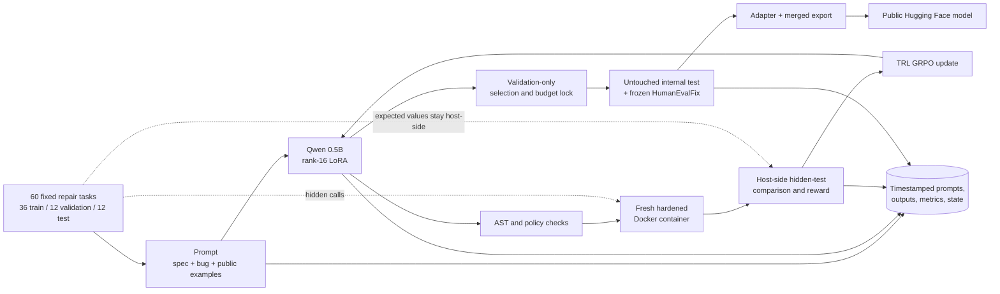

# MiniBug-RL

MiniBug-RL is a complete, measured recipe for adding test-driven reinforcement learning to a tiny code LLM on one 8 GB GPU. It fine-tunes the 0.49B-parameter [Qwen2.5-Coder-0.5B-Instruct](https://huggingface.co/Qwen/Qwen2.5-Coder-0.5B-Instruct) with 100 steps of TRL GRPO and a rank-16 LoRA adapter. The policy repairs one short Python function, receives scalar rewards from hidden unit tests, and never sees the hidden expected values.

The resulting public model is [BurnyCoder/qwen2.5-coder-0.5b-swe-rl](https://huggingface.co/BurnyCoder/qwen2.5-coder-0.5b-swe-rl), pinned at Hub commit [`5b6e22a4c6c01bec95d10e93a0fc78666eb9c543`](https://huggingface.co/BurnyCoder/qwen2.5-coder-0.5b-swe-rl/commit/5b6e22a4c6c01bec95d10e93a0fc78666eb9c543). Its repository root is a directly loadable merged model; `adapter/` contains the separate PEFT artifact.

## Methodology and data flow

The experiment uses an original 60-task curriculum fixed before training: 36 train, 12 validation, and 12 final-test repairs. Prompts contain a specification, buggy function, and two public examples. Four sampled repairs per training prompt are parsed, run in fresh resource-limited Docker containers, and compared with hidden answers on the host. The reward is hidden-test pass fraction + a `1.0` full-solve bonus + `0.1` for a valid function, with bounded runtime and policy penalties. GRPO updates only LoRA parameters; the base revision stays pinned.

Checkpoint choice used validation; the 100-step stopping decision used only training diagnostics and validation, never final data. After checkpoint 100 was locked, the project opened the internal final split once and then ran a frozen 164-task HumanEvalFixDocs-Python comparison. Every model prompt and completion is written without truncation to a timestamped local log. See [methodology](docs/methodology.md) for the full protocol and [curriculum documentation](data/README.md) for the split and leakage contract.



Generated code runs through Docker, not Python `exec` in the training process. Containers use no network, a read-only root, a non-root user, dropped capabilities, no mounts, and CPU/memory/PID/time limits. Containers still share the host kernel, so read the [security model](docs/security.md) before adapting this to hostile code.

## Measured result

The run used an NVIDIA GeForce RTX 5070 Laptop GPU with 8,151 MiB reported memory. Main training took 1,174 seconds, peaked at 1,849,278,976 allocated bytes (1.72 GiB), changed all 336 trainable LoRA tensors, and ended without the reward-collapse stop.

| Locked evaluation | Base model | 100-step model | Paired difference |
|---|---:|---:|---:|
| Validation greedy full repairs (12 tasks) | 7/12 | 8/12 | +1 task |
| Validation mean greedy hidden fraction | 0.7708 | 0.8333 | +0.0625, 95% CI [−0.1458, 0.2917] |
| Internal-test greedy full repairs (12 tasks) | 5/12 | 6/12 | +1 task |
| Internal-test mean greedy hidden fraction | 0.6083 | 0.6042 | −0.0042, 95% CI [−0.2917, 0.2625] |
| Internal observed sampled success@4 | 10/12 | 10/12 | 0 tasks |
| Internal invalid candidates (60 each) | 19 | 1 | −18 candidates |
| HumanEvalFix greedy pass@1 (164 tasks) | 37/164 | 38/164 | +0.0061, 95% CI [−0.0183, 0.0366] |

The validation gate passed, and malformed internal outputs fell sharply. The held-out correctness intervals cross zero, however, so this run demonstrates a practically functioning RL pipeline and better output reliability—not conclusive general software-engineering capability improvement. HumanEvalFix used this project’s stricter 3-second Docker deadline rather than the BigCode harness’s 10-second Python limit; it is not a leaderboard-identical score. Full results and task-level changes are in the [experiment ledger](reports/README.md).

## Run it exactly

Prerequisites are Linux or WSL2, an NVIDIA CUDA GPU with about 8 GB VRAM, a working Docker daemon, Git, and [uv](https://docs.astral.sh/uv/). The locked environment uses Python 3.12, PyTorch 2.14.0 with CUDA 13.0, Transformers 5.16.1, TRL 1.12.0, and PEFT 0.20.0.

```bash
git clone https://github.com/BurnyCoder/llm-rl-software-engineering.git
cd llm-rl-software-engineering
git checkout 7027bc55baecc00fad51cbe2b8f030dca2c91c1e
uv sync --locked
cp .env.example .env
chmod 600 .env

RUN_ID="$(date -u +%Y%m%dT%H%M%SZ)-minibug-rl-main"
uv run swe-rl all --config configs/local-8gb.toml --run-id "$RUN_ID" --skip-publish
```

The single command runs preflight → preparation → base validation → two-step smoke → 100-step training → validation selection → locked evaluations → verified export. It builds the sandbox image, downloads only pinned model/dataset revisions, resumes completed phases from `logs/$RUN_ID/state.json`, and writes model artifacts under `artifacts/`. Publication is intentionally separate because it changes remote state:

```bash
# Put HF_TOKEN and, if needed, HF_MODEL_REPO in the ignored mode-600 .env first.
uv run swe-rl publish --config configs/local-8gb.toml --run-id "$RUN_ID"
```

The exact phase-by-phase procedure, expected files, resume behavior, lower-memory adjustments, test commands, and troubleshooting are in the [step-by-step guide](docs/guide.md). Reproducibility hashes and nondeterminism boundaries are in [docs/reproducibility.md](docs/reproducibility.md).

## Load the resulting model

Load the immutable merged model directly with Transformers:

```python
import json

from transformers import AutoModelForCausalLM, AutoTokenizer

model_id = "BurnyCoder/qwen2.5-coder-0.5b-swe-rl"
revision = "5b6e22a4c6c01bec95d10e93a0fc78666eb9c543"
tokenizer = AutoTokenizer.from_pretrained(model_id, revision=revision)
model = AutoModelForCausalLM.from_pretrained(
    model_id,
    revision=revision,
    dtype="auto",
)

system = (
    "You repair one pure Python function. Return exactly one complete replacement "
    "function and nothing else. Do not import modules or use unsafe builtins."
)
examples = [
    {"args": [5, 0, 10], "kwargs": {}, "expected": 5},
    {"args": [-3, 0, 10], "kwargs": {}, "expected": 0},
]
user = (
    "Specification:\nReturn value limited to the inclusive interval [low, high]. "
    "Assume low is not greater than high.\n\n"
    "Buggy function:\n```python\n"
    "def clamp_value(value, low, high):\n"
    "    return min(low, max(value, high))\n```\n\n"
    f"Public examples as JSON calls:\n{json.dumps(examples, indent=2)}\n\n"
    "Write the corrected `clamp_value` function now."
)
messages = [{"role": "system", "content": system}, {"role": "user", "content": user}]
prompt = tokenizer.apply_chat_template(messages, tokenize=False, add_generation_prompt=True)
inputs = tokenizer(prompt, return_tensors="pt", add_special_tokens=False)
output = model.generate(**inputs, max_new_tokens=128, do_sample=False)
print(tokenizer.decode(output[0, inputs.input_ids.shape[1] :], skip_special_tokens=True))
```

The immutable revision above was re-downloaded and this exact snippet returned a fenced
`clamp_value` implementation using `max(low, min(value, high))`.

The model is specialized for constrained single-function Python repair. Do not execute generated code without isolation.

## What guide this follows

[DebugArena](https://huggingface.co/BharathVikas/debugarena) supplied the useful starting idea—Qwen2.5-Coder-0.5B, four GRPO generations, hidden test rewards, and a `1e-5` learning rate. Its short README snippet is not a complete reproducible procedure: `compute_reward`, the dataset, trainable-adapter attachment, sandbox, split discipline, evaluation, export, and resulting weights are outside that snippet.

This repository therefore follows the exact installed APIs and pinned official references: [TRL 1.12 GRPOTrainer](https://huggingface.co/docs/trl/v1.12.0/en/grpo_trainer), [PEFT LoRA](https://huggingface.co/docs/peft/main/package_reference/lora), [Transformers generation](https://huggingface.co/docs/transformers/main_classes/text_generation), [HumanEvalPack](https://huggingface.co/datasets/bigcode/humanevalpack/blob/9a41762f73a8cb23bb5811b73d5aab164efcf378/README.md), and [Hugging Face Hub upload/download](https://huggingface.co/docs/huggingface_hub/guides/upload). Standard Transformers BF16 + PEFT is used instead of copying the Unsloth loader line, which keeps the exercised implementation within one locked dependency stack.

## Repository map

- `src/minibug_rl/`: thin phase wrapper plus modular data, training, reward, sandbox, evaluation, export, and publication code.
- `configs/`: checked hardware profiles and exact hyperparameters.
- `data/`: original curriculum and structural split manifest.
- `sandbox/`: no-network Docker runner for generated code.
- `tests/`: unit, integration, pinned-network, and opt-in real-container tests.
- `docs/`: operational guide, methodology, security, and reproducibility details.
- `reports/`: canonical evidence and chronological experiment reports.
- `paper/` and `output/pdf/`: source and compiled experiment paper.

The code and resulting model are Apache-2.0 licensed. The upstream base model and HumanEvalPack are also identified by their own pinned repositories and terms.
